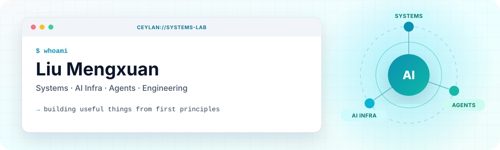

 

  

<code>Python</code>
<code>C++</code>
<code>Kubernetes</code>
<code>LLM Serving</code>
<code>AI Infrastructure</code>
<code>Agent Systems</code>

## 🛰️ Hello, World

我是刘梦轩，也可以叫我 **Ceylan**。我喜欢从系统的第一性原理出发，把模糊的问题拆成能运行、能测量、能继续演进的工程。

> 我关注的不只是「让 AI 工作」，而是如何让它在真实系统里跑得更快、更稳，也更像一个可靠的协作者。

<table>
  <tr>
    <td width="50%" valign="top">
      <h3>🧠 我在思考</h3>
      <ul>
        <li>分布式系统与性能优化</li>
        <li>LLM Serving 与 AI Infra</li>
        <li>Agent 工具循环与工作流</li>
        <li>面向开发者的工程体验</li>
      </ul>
    </td>
    <td width="50%" valign="top">
      <h3>🚧 我在构建</h3>
      <ul>
        <li>轻量级终端编程助手</li>
        <li>论文翻译与知识处理工具</li>
        <li>从 JD 到面试的项目准备工具</li>
        <li>更有趣的 Vibe Coding 实验</li>
      </ul>
    </td>
  </tr>
</table>

## ✦ Selected Builds

<table>
  <tr>
    <td width="50%" valign="top">
      <h3><a href="https://github.com/LiuMengxuan04/MiniCode">⌁ MiniCode</a></h3>
      
一个轻量级终端编程助手。用清晰的工具循环、TUI 架构和多语言实现，拆解 Claude Code 类产品背后的工程机制。

      
      
      
      
    </td>
    <td width="50%" valign="top">
      <h3><a href="https://github.com/LiuMengxuan04/shushu-internship-tool">⚡ SIT</a></h3>
      
把岗位描述变成项目，把项目变成简历，再把简历变成面试。覆盖选题、代码摸底、复现改造、STAR 与 Q&amp;A。

      
      
      
    </td>
  </tr>
  <tr>
    <td width="50%" valign="top">
      <h3><a href="https://github.com/LiuMengxuan04/vibe-resume">◈ vibe-resume</a></h3>
      
像 Vibe Coding 一样编辑简历：把内容表达、实时预览和快速迭代放在同一个轻巧的工作台里。

      
      
      
    </td>
    <td width="50%" valign="top">
      <h3><a href="https://github.com/LiuMengxuan04/translate-paper-pdf-to-md">⌘ Paper → Markdown</a></h3>
      
把英文论文翻译为高质量 Markdown，并尽量保留结构、图片、表格、公式、引用与参考文献。

      
      
      
    </td>
  </tr>
</table>

## 🧭 Field Notes

| 信号 | 位置 | 我做的事 |
|:---:|---|---|
| `WORK` | **哔哩哔哩 · 机器学习平台开发工程师** | 支撑核心推荐系统业务，接触真实规模下的平台与调度问题 |
| `WORK` | **华为技术有限公司 · 应用软件开发工程师** | 首届「东南大学－华为 ICT 菁英班」成员 |
| `EDU` | **东南大学 · 软件工程本科** | 在系统、工程与 AI 的交叉地带持续探索 |
| `NEXT` | **东南大学 · 计算机科学与技术硕士** | 师从[李传佑副教授](https://cs.seu.edu.cn/cyli/main.htm) |

## 🧰 Toolbox

  

`systems thinking` · `performance profiling` · `tool use` · `workflow design` · `ship → measure → iterate`

## 📡 Activity Signal

 

  
<strong>🌍 English snapshot</strong>

   
  

    I'm Liu Mengxuan (Ceylan), a systems-minded engineer exploring AI infrastructure,
    LLM serving, and agent workflows. I enjoy turning fuzzy ideas into software that
    can be run, measured, and improved.
  

  <ul>
    <li><strong>Bilibili</strong> — Machine Learning Platform Engineer, supporting core recommendation workloads.</li>
    <li><strong>Huawei</strong> — Application Software Engineer and a member of the first SEU–Huawei ICT Elite Program.</li>
    <li><strong>Southeast University</strong> — B.E. in Software Engineering; prospective M.S. in Computer Science.</li>
  </ul>

---

### Let's make the machine a little more useful.

  

Stay curious · Build deeply · Iterate relentlessly

